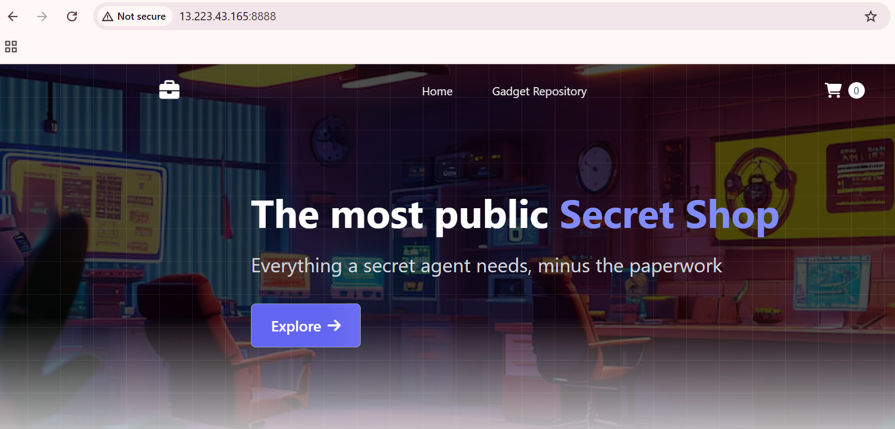
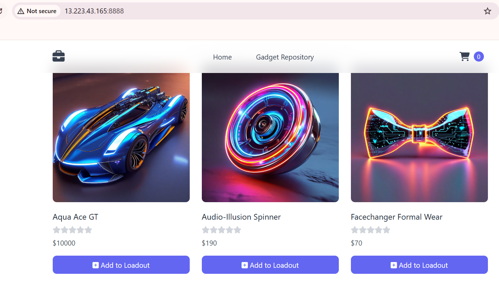
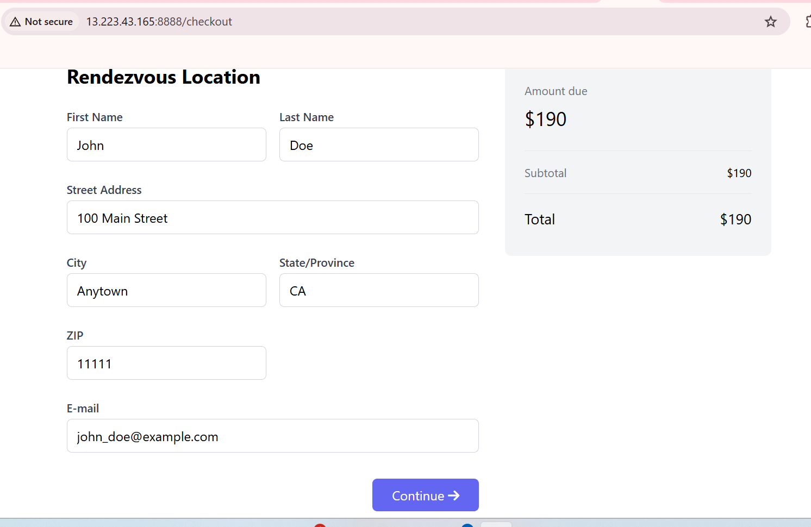
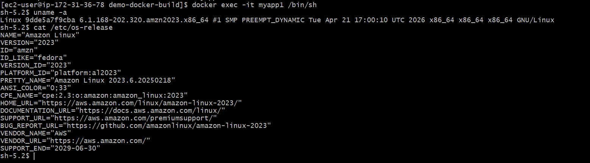
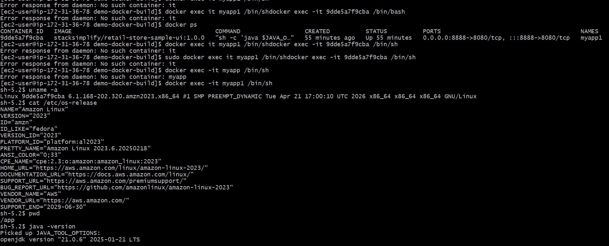

#pull docker image from docker hub
docker pull stacksimplify/retail-store-sample-ui:1.0.0

# Run Docker Container
docker run --name <CONTAINER-NAME> -p <HOST_PORT>:<CONTAINER_PORT> -d <IMAGE_NAME>:<TAG>

# Example using Docker Hub image:
docker run --name myapp1 -p 8888:8080 -d stacksimplify/retail-store-sample-ui:1.0.0

#docker enter command
docker exec -it <containername> /bin/bash

 # List files/folders in the container's root directory
 docker exec -it myapp1 ls
 # # Test if the application is running inside the container
# Sends a request to the app on port 8080 (internal container port)
# Create a Folder
mkdir demo-docker-build
cd demo-docker-build

# Download the Application Source
wget https://github.com/aws-containers/retail-store-sample-app/archive/refs/tags/v1.2.4.zip

# Unzip Application Source
unzip v1.2.4.zip

# Make change to file
cd /home/ec2-user/demo-docker-build/retail-store-sample-app-1.2.4/src/ui/src/main/resources/templates
File name: home.html
We are making a change for UI stating V2 at line 

# List to Verify if we are at that file
ls home.html
ls -lrt

# Changes we are doing 
## Before
          The most public Secret Shop

## After
          The most public Secret Shop - V2 Version          

# Command to Make That Change via Terminal (No Manual Editing)
sed -i 's/Secret Shop<\/span>/Secret Shop - V2 Version<\/span>/' home.html

# Verify It Worked:
grep 'Secret Shop' home.html
