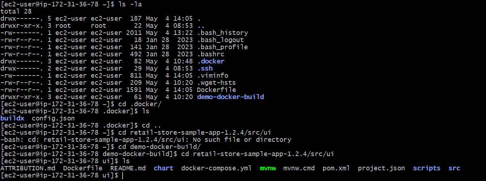
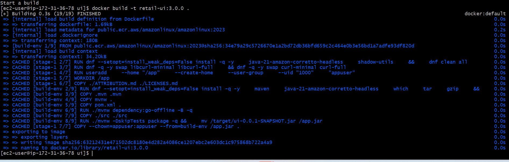
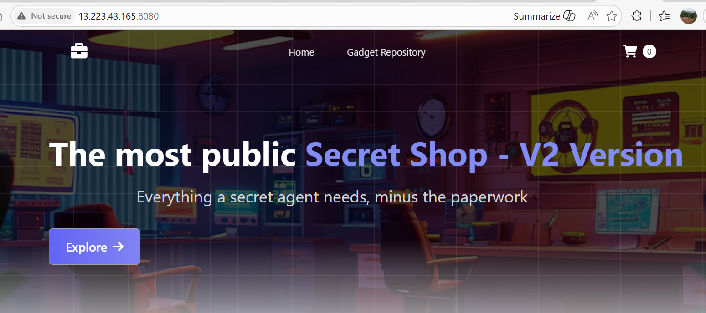
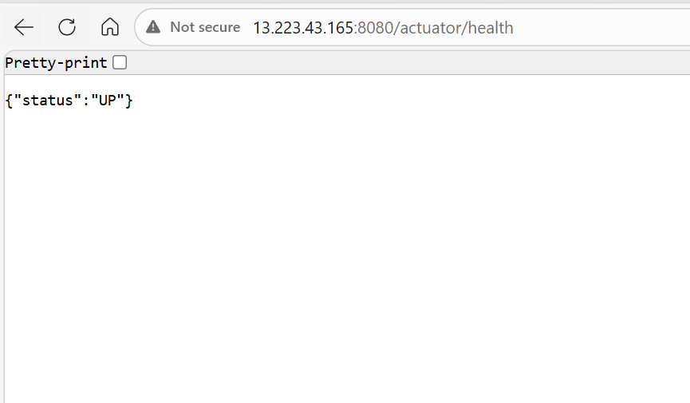
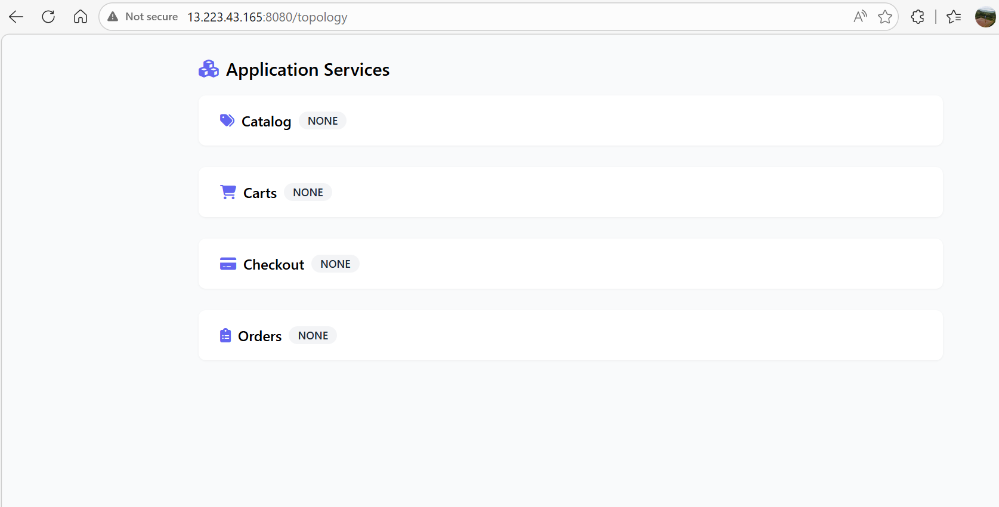
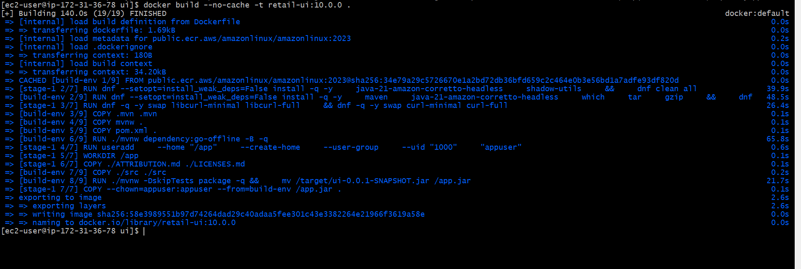
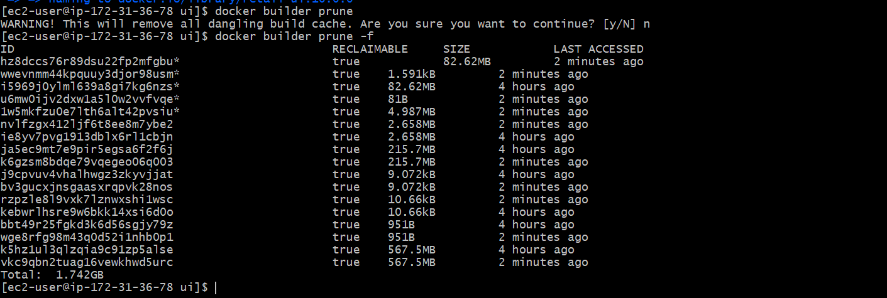
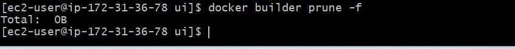

 # Dockerfile Basic Instruction
 FROM
  pick a base image to build from
RUN
 excute a command during image build (install packages)
VOLUME
 create a mount point for persistent or shared data 
WORKDIR
 sets the working directory for following instruction
COPY 
 copy file from host into the images
ENV
 Define env veriable inside the image
USER
Define the user to to avoide running as root -improve security
EXPOSE
 Documnets the port the container will listen on
ENTRYPOINT 
Sets the default command to run when the container start

# Difference between package stage vs build stage 
 Build Stage              Package stage 
 build/compile code     create final image
 large in size            small in size
 required tool for compile  not required
 we can not use at runtime  we can use at  run time

 # Docker Multi stage 
  Separate build & runtime
  Lightweight final image
  Production-ready

# Build docker image

# go to this path
cd retail-store-sample-app-1.2.4/src/ui 
# to build the Dockerfile command
docker build -t <imagename> .

# with port 8080

# verify from the spripng boot health 
docker ps
http://<EC2-Instance-Public-Ip>:8080/actuator/health
http://<EC2-Instance-Public-Ip>:8080/topology

# Docker Layer Caching
docker build image in layer and when we re build the image it will skip redundent by re-used the cache layer 

# if we want to run from the scrach
docker build --no-cache -t retail-ui:10.0.0 .

# remove all build caches
docker build prune

# prompt for comfirmation
docker build prune -f

# remove all buld caches
docker build prune --all

# force run 
docker builder prune --all -f
 # Clean Everything Unused (Stopped containers, volumes, networks, cache, images)**
 docker system prune
 # To clean everything including volumes:
 docker system prune --volumes