# CAP Drop
all security releated capability dropping
# Cap_add (net bind service)
net bind service it means it will allow less than 1024 port
# Cap_drop(all)
 rest permission should be drop 

 Docker Compose install 
 # Create the CLI plugin directory
sudo mkdir -p /usr/local/lib/docker/cli-plugins

# Download the latest Docker Compose v2 binary (always pulls the newest release)
wget https://github.com/docker/compose/releases/latest/download/docker-compose-linux-x86_64 -O docker-compose

# Make it executable
chmod +x docker-compose

# Move it to the CLI plugins directory
sudo mv docker-compose /usr/local/lib/docker/cli-plugins/docker-compose

# Verify install
docker compose version
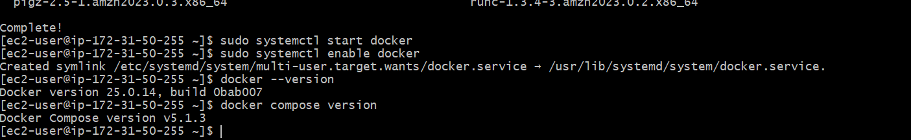
Compose Up / Down / Logs

# Create Directory
mkdir demo-compose
cd demo-compose

# Download the Docker Compose file
wget https://github.com/aws-containers/retail-store-sample-app/releases/download/v1.3.0/docker-compose.yaml

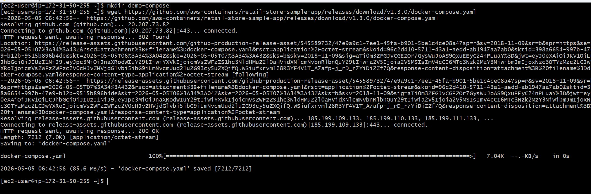

# Set environment variable
export DB_PASSWORD='mydbkalyan101'

# Start all services
Step-03: Services Used in This Project
S.No	Application	Image
1	cart	public.ecr.aws/aws-containers/retail-store-sample-cart:1.3.0
2	carts-db	amazon/dynamodb-local:1.20.0
3	catalog	public.ecr.aws/aws-containers/retail-store-sample-catalog:1.3.0
4	catalog-db	mariadb:10.9
5	checkout	public.ecr.aws/aws-containers/retail-store-sample-checkout:1.3.0
6	checkout-redis	redis:6.0-alpine
7	orders	public.ecr.aws/aws-containers/retail-store-sample-orders:1.3.0
8	orders-db	postgres:16.1
9	rabbitmq	rabbitmq:3-management
10	ui	public.ecr.aws/aws-containers/retail-store-sample-ui:1.3.0

used service list 
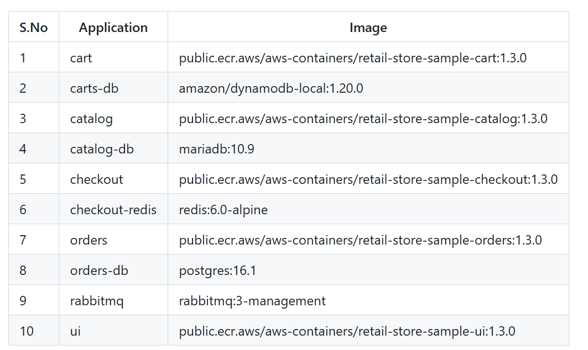

## Important Note:  if your file name is docker-compose.yaml dont need to specify -f with file
docker compose -f docker-compose.yaml up
docker compose up 
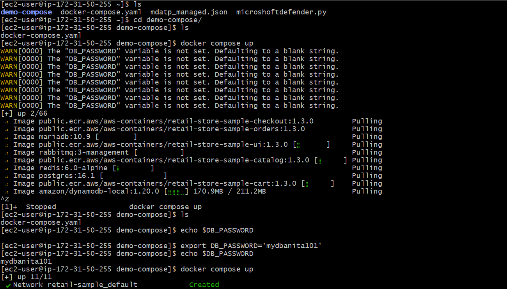

# OR start in detached mode (background)
docker compose -f docker-compose.yaml up -d
using below command
docker compose up 
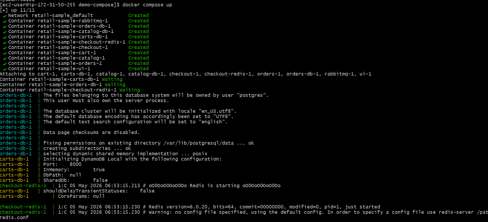

docker compose up -d

# Stop all services (gracefully) (NOT NEEDED NOW - JUST FOR REFERENCE)
docker compose down
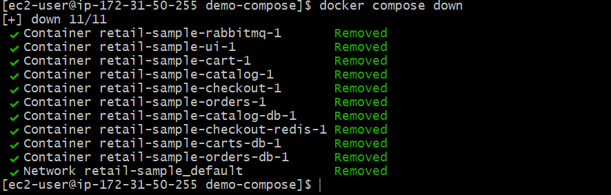
Output on browser 
http://<EC2-Instance-Public-IP>:8888
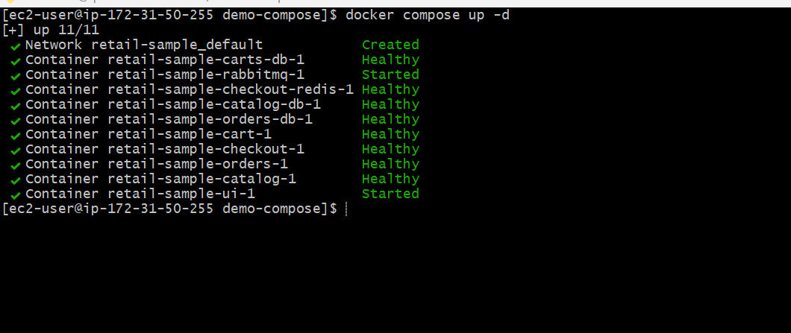
http://<EC2-Instance-Public-IP>:8888/topology

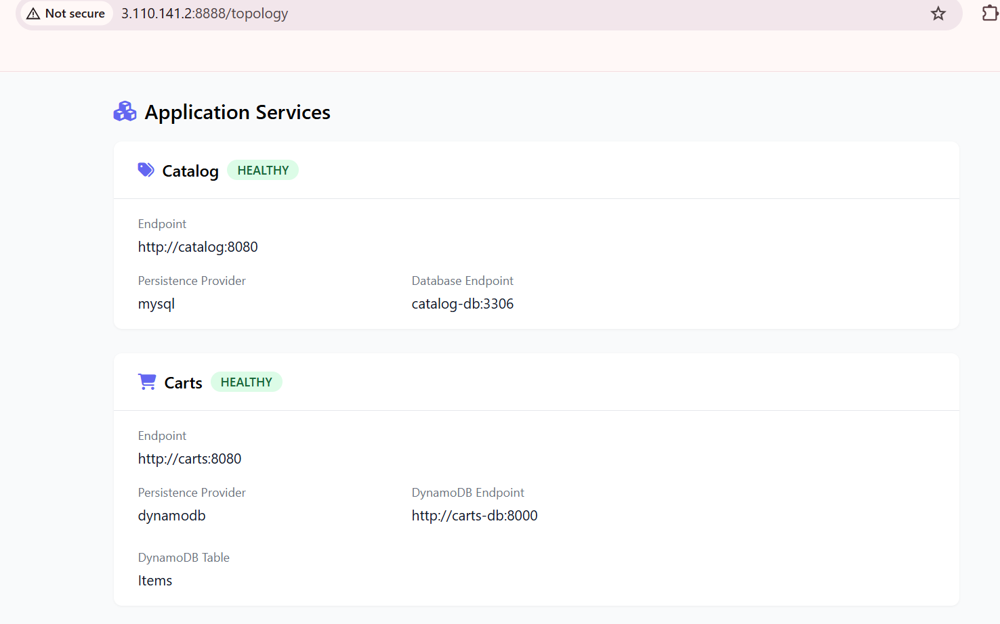

Usful docker compose command 
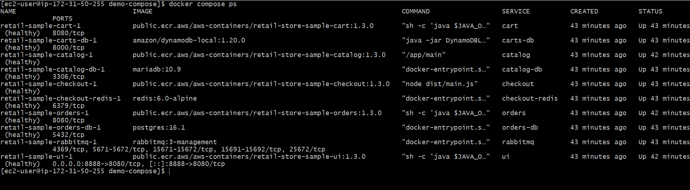
# List Services 
docker compose ps

# Also verify Docker images it downloaed
docker images
Stop and start single service
# Stop a Service
docker compose stop orders
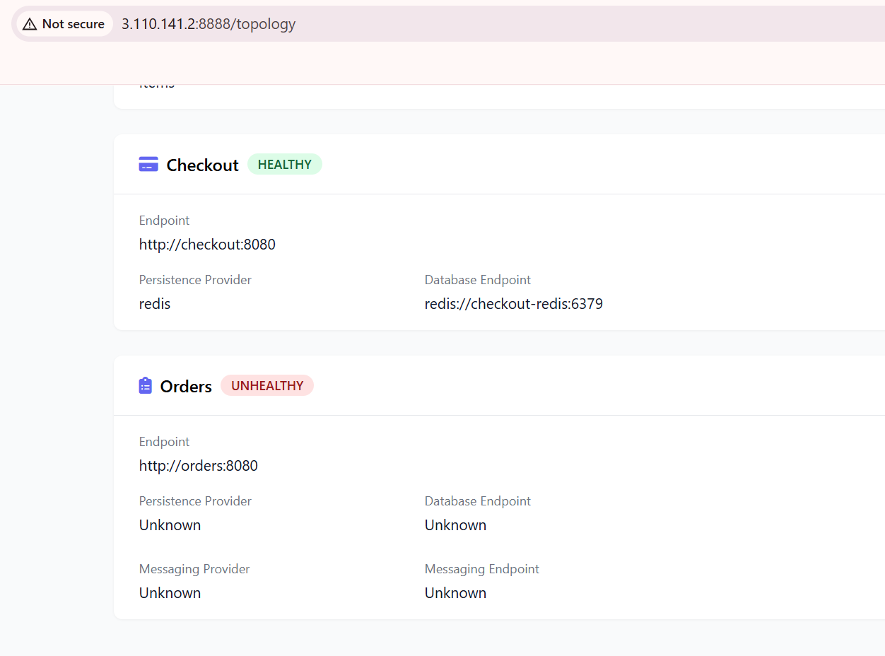

# Verify if service is stopped
docker compose ps
docker compose ps -a

# Start a Service
docker compose start orders
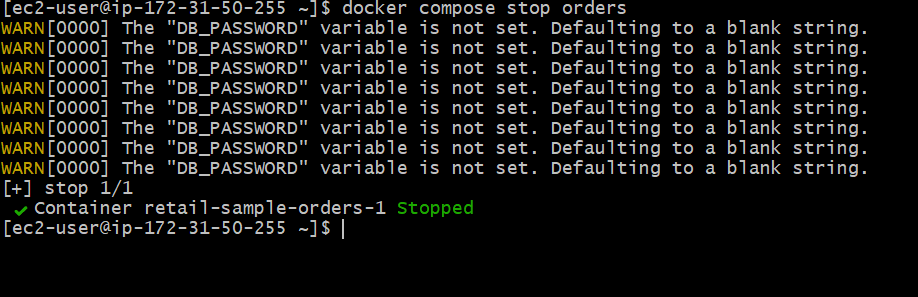
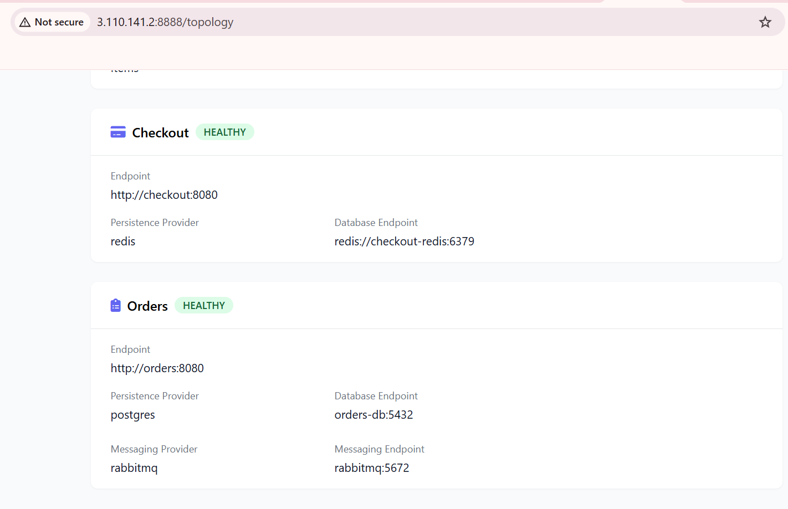
Restart a Service 
# Restart a Service
docker compose restart cart

# Verify if service restarted
docker compose ps

# View Logs
# Logs for all services
docker compose logs

# Logs for a specific service
docker compose logs checkout

# Follow logs
docker compose logs -f checkout

UI logs 
docker compose ui logs
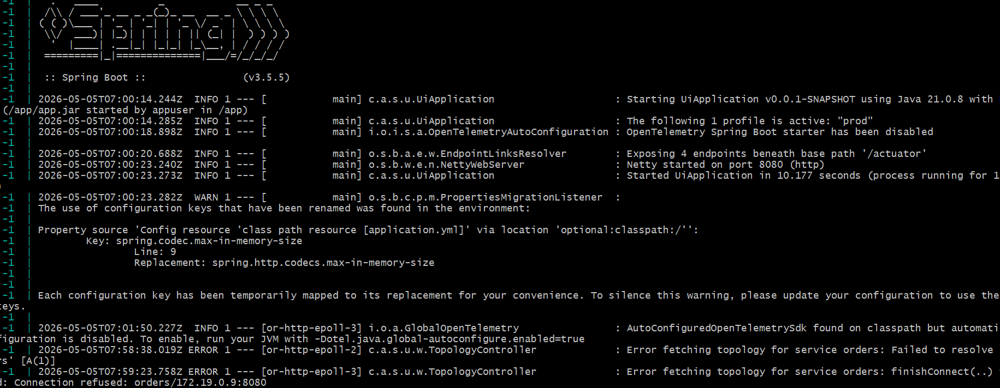

 Run Commands Inside a Container
 # Connect to a Container
docker compose exec ui sh

# Commands to run in container
ls
id
uname -m
uname -n
env
cat /etc/hostname
cat /etc/os-release 
cat /etc/os-release | sed -n '1,6p' 
curl http://localhost:8080
curl http://localhost:8080/topology
curl http://localhost:8080/actuator/health
exit

Docker Compose Stats
# Stats 
docker compose stats
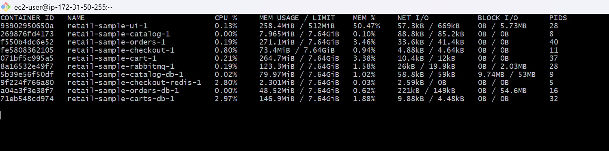
# Specific Containers
docker compose stats ui
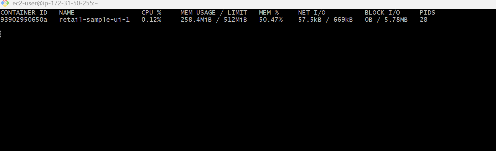
Display the running process in a container
# Display the running process of all service containers
docker compose top

# Specific containers
docker compose top ui
docker compose top checkout

UI App: Make changes to Docker Compose and Deploy
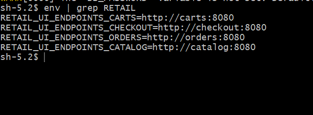

docker command to stop and start the ui
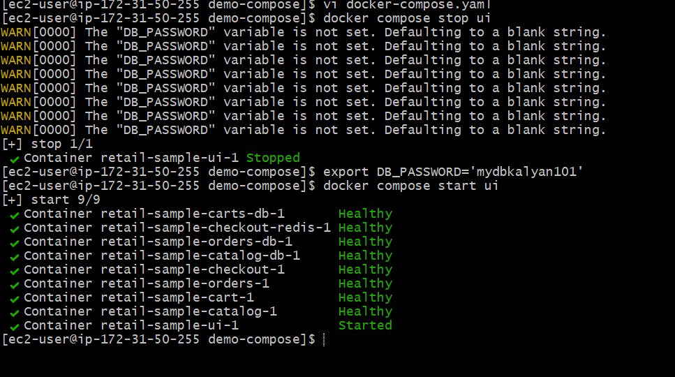

Force recreate UI Container
# Stop All Services
docker compose up -d --force-recreate ui

[or]

# Stop All Services
docker compose down 

# Start All Services
docker compose up -d

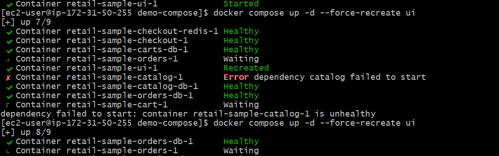
 # using command 
docker compose up -d --force-recreate ui

allow port in my security group
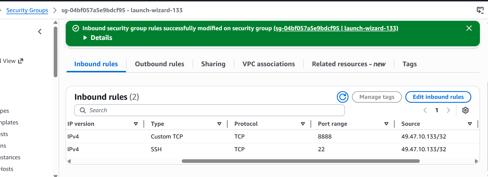
