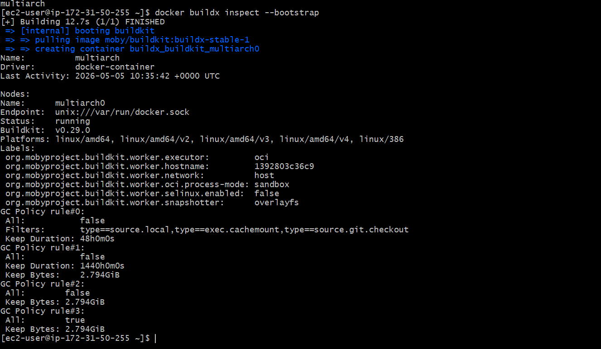
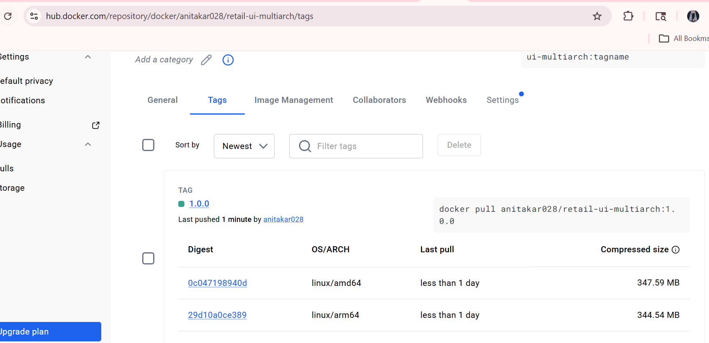
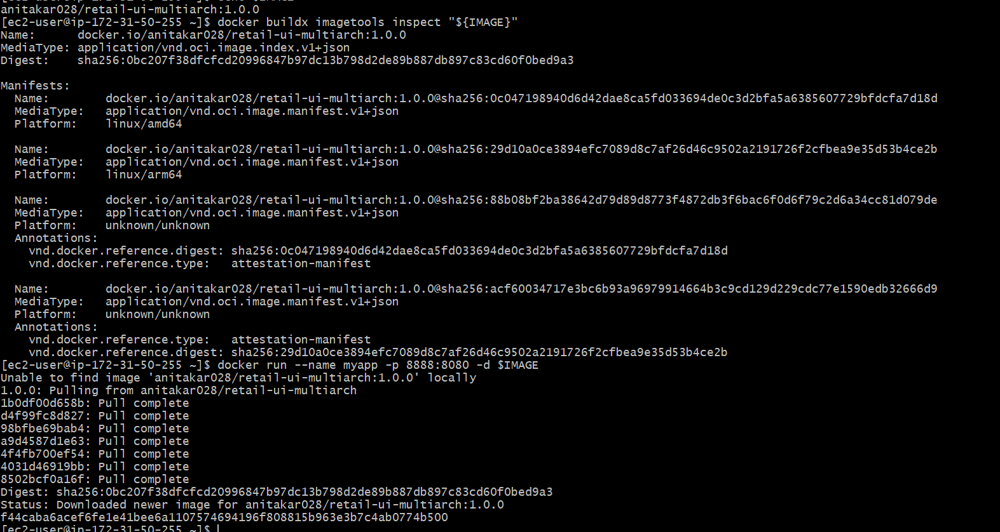
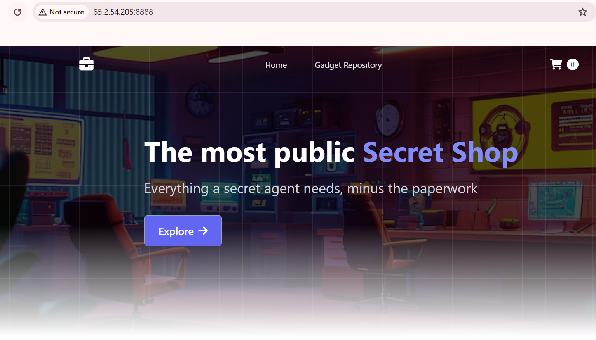

# What you’ll do
Host sanity check
Install Docker Engine and enable Buildx
Install binfmt/QEMU for cross-arch builds
Create a containerized Buildx builder (multi-arch)
Log in to Docker Hub
Build & push a multi-platform manifest (linux/amd64,linux/arm64)
Verify manifest and run containers
Access the app in your browser on ports 8888

# Host sanity check
cat /etc/os-release | sed -n '1,6p'     # Amazon Linux 
uname -m                                 # expect: x86_64

# Ensure Buildx/BuildKit is available
export DOCKER_BUILDKIT=1
docker buildx version

# Install binfmt/QEMU emulators (cross-arch)
# Reinstall QEMU binfmt handlers
docker run --privileged --rm tonistiigi/binfmt --install all

# OR explicitly for arm64 + amd64
docker run --privileged --rm tonistiigi/binfmt --install arm64,amd64

# Create a containerized Buildx builder (multi-arch capable)
# Create a new multiarch builder that uses BuildKit in a container
docker buildx create --name multiarch --driver docker-container --use

# Bootstrap to detect all supported platforms
docker buildx inspect --bootstrap

# List Buildx Builders
docker buildx ls

# Docker Hub login & variables
# ---- CONFIG (edit these) ----
export DOCKERHUB_USER="your-dockerhub-username"     # CHANGE
export DH_REPO="retail-ui-multiarch"             # repo name under your namespace
export TAG="1.0.0"                                  # image tag

# UPDATED TO MY ENVIRONMENT
export DOCKERHUB_USER="stacksimplify"     # CHANGE
export DH_REPO="retail-ui-multiarch"             # repo name under your namespace
export TAG="1.0.0"                                  # image tag

# ---- DERIVED ----
export IMAGE="${DOCKERHUB_USER}/${DH_REPO}:${TAG}"
echo $IMAGE

# Login to Docker Hub (will prompt for password or PAT)
docker login -u "${DOCKERHUB_USER}"

# Use your Dockerfile (Retail Store UI)
# Create a Folder
mkdir demo-multiarch
cd demo-multiarch

# Download the Application Source
wget https://github.com/aws-containers/retail-store-sample-app/archive/refs/tags/v1.3.0.zip

# Unzip Application Source
unzip v1.3.0.zip

# Change Directory to UI Source folder
cd retail-store-sample-app-1.3.0/src/ui
cat Dockerfile

BuildKit is the modern build engine used by Docker to build container images faster, more efficiently, and with advanced features.

DOCKER_BUILDKIT=1

Enables BuildKit (modern build engine of Docker)
Faster builds ⚡
Better caching
Required for advanced features like multi-arch

noexec

👉 ❌ Prevent execution of files from /tmp

Even if someone uploads a script → it cannot run
Protects from attacks
4. nosuid

👉 ❌ Ignore SUID/SGID permissions

Prevents privilege escalation
Stops users from gaining root via special binaries

 AMD64: Run and test the containers
 # List Docker Containers
docker ps

# Run Docker Container using new Docker Image 
docker run --name myapp1-amd64 -p 8888:8080 -d ${IMAGE}

# List Docker Images
docker images

# List Docker Containers
docker ps

# Access in browser
http://<EC2-Public-IP>:8888

