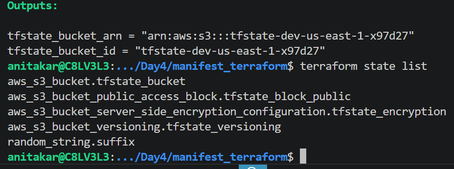
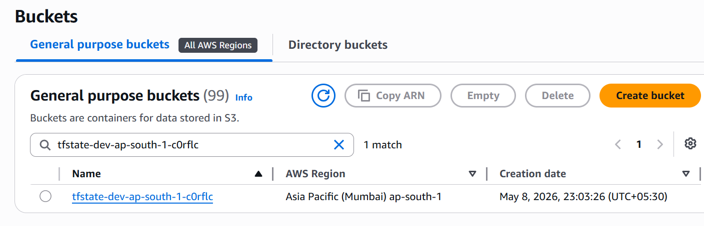

# Terraform remote state locking 

# Why Use Remote Backend?
1. Team Collaboration: Prevent state conflicts when multiple people run Terraform.
2. State Locking: Avoids race conditions using DynamoDB.
3. Durability: S3 ensures highly available and persistent state storage.