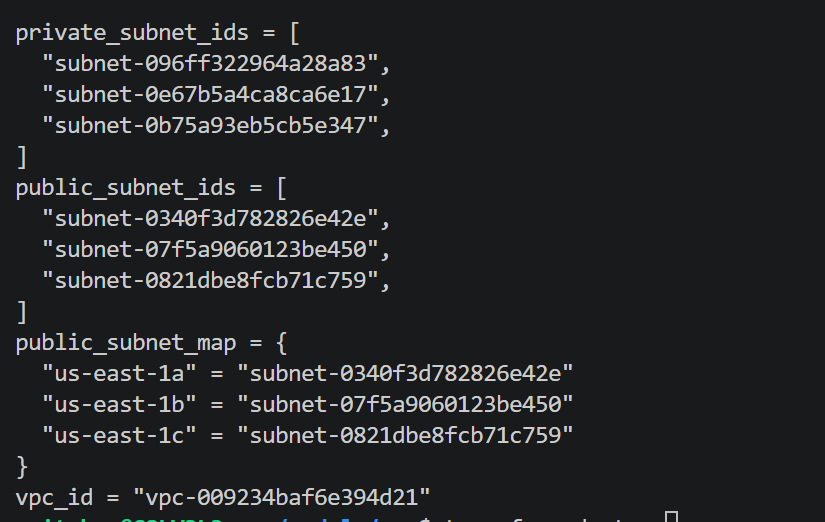

using module

# what is module?
terraform module help you to organize the reusable infracture code.

# There are two type of module
1.local module
2. remote module

# module structure 
terraform-project/
├── main.tf
├── variables.tf
├── outputs.tf
├── provider.tf
├── terraform.tfvars
├── backend.tf
├── modules/
│   ├── vpc/
│   │   ├── main.tf
│   │   ├── variables.tf
│   │   ├── outputs.tf
│   │   └── versions.tf
│   │
│   ├── eks/
│   │   ├── main.tf
│   │   ├── variables.tf
│   │   ├── outputs.tf
│   │   └── versions.tf
│   │
│   └── security-group/
│       ├── main.tf
│       ├── variables.tf
│       └── outputs.tf

# module file breakdown 
modules/vpc/main.tf	---> Core VPC resource definitions
modules/vpc/variables.tf -->	Inputs required by the VPC module
modules/vpc/outputs.tf --> Outputs exported by the module
modules/vpc/datasources-and-locals.tf -->	Contains data blocks and locals

# Benefits of Modularization
Reusability: Same VPC module can be used across environments (dev, test, prod).
Isolation: VPC logic is isolated from the rest of the infrastructure.
Consistency: Centralized config leads to fewer errors and better collaboration.
Scalability: Easy to extend module with more resources or logic.
