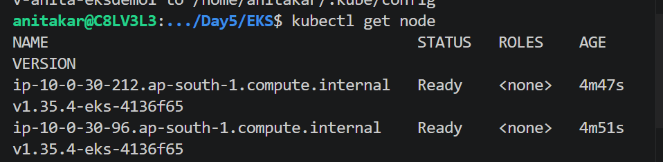
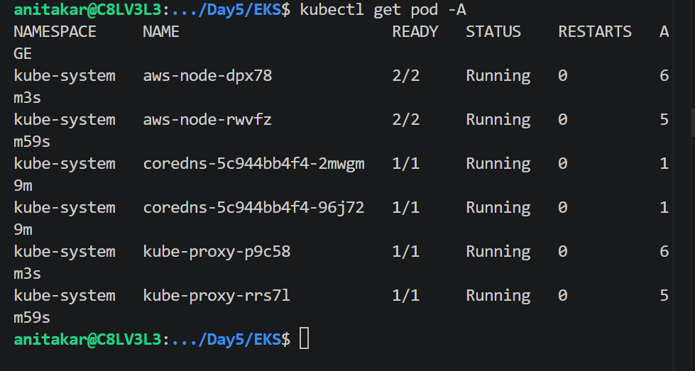
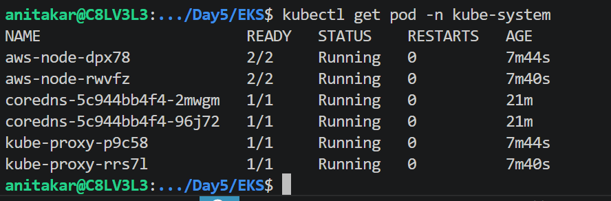
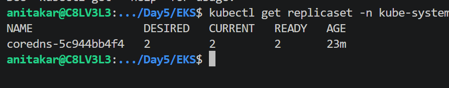
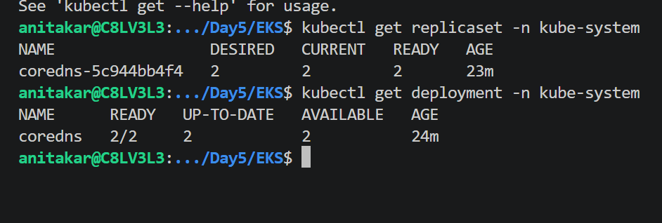
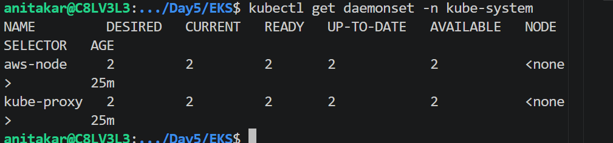
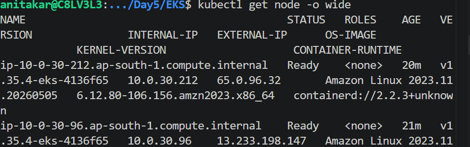
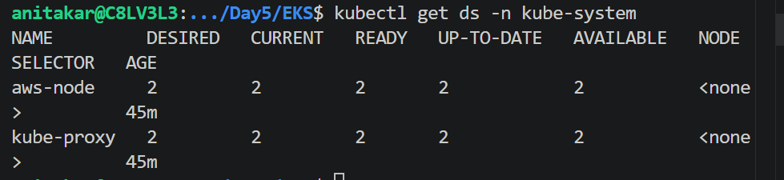

kubectl get node

kubectl get pod -A

kubectl get pod -n kube-system

kubectl get replicaset -n kube-system

kubectl get deployment -n kube-system

kubectl get daemonset -n kube-system

kubectl get node -n kube-system -o wide

kubectl get ds -n kube-system
