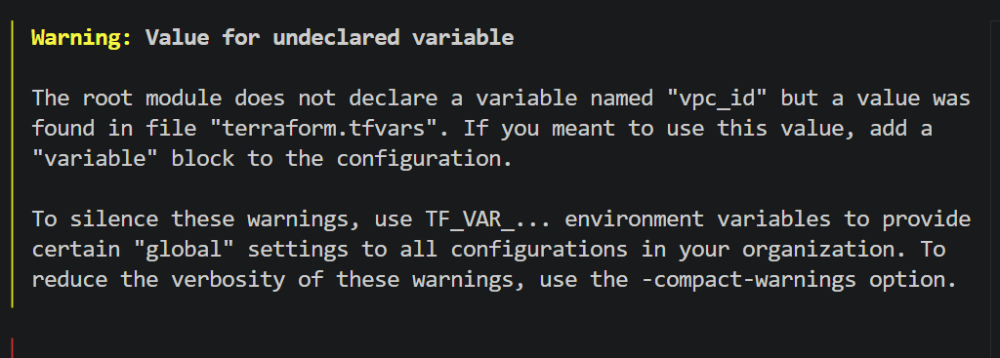
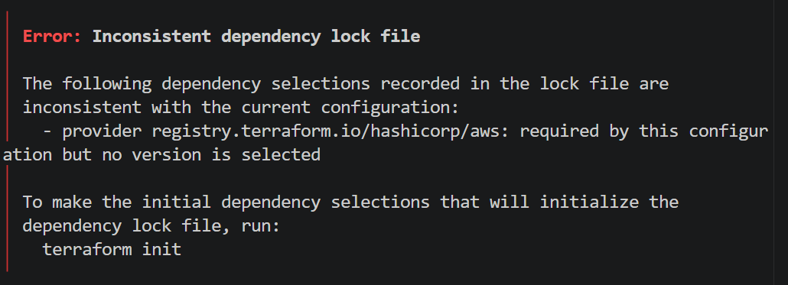

# why kuberenetes ?why not docker swarm
  Feature               Docker swarm                           Kubernetes
1.ease to setup        very easy build into docker             more complecated 
2. Learning curve      easy for bigneer                        required more effort but more powerfull
3. scability         limited ,good for small cluster           enterprise grade, scale to thousand of node
4. Ecosytem & adoption  low adopation and limited comunity      huge ecosystem, industry standard
5. Load balancing     built-in basic round robin              advance service descovy and load balancing     
6. High avaibility    basic failover support               strong self healing, pod reschuduling
7. storage          basic volume support                    rich persistent volume and storage class
8. networking       simpler and less failover                advance cni networking and failover 
9. cloud support   no manage swarm service                  fully manage service
10. use case     small simple workload or dev/tes           production enterprise multi cloud

run the init command for this

