kubectl apply -f catalog-deployment.yaml
kubectl get pod 
kubectl get deployment 
kubectl get rs 
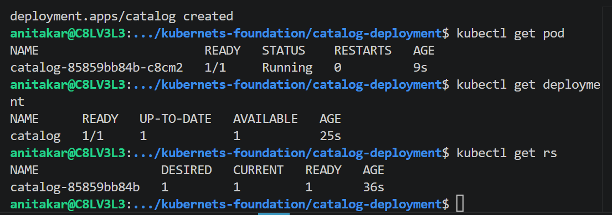

kubectl get pod -o wide
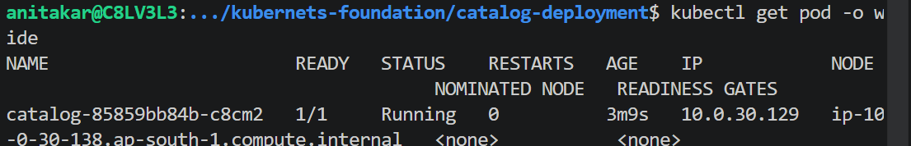

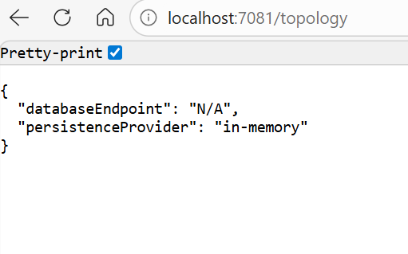
kubectl port-forward deploy/catalog 7081:8080

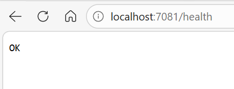

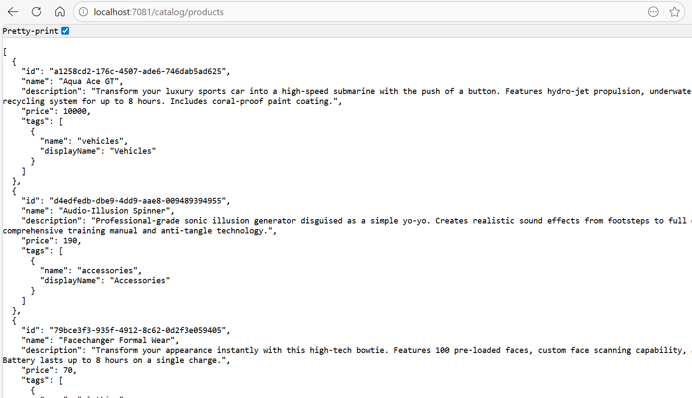

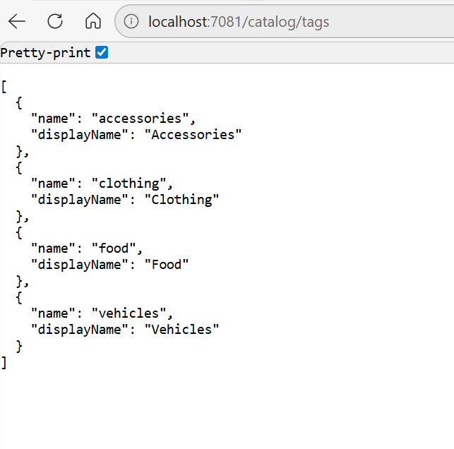

kubectl scale deployment catalog --replicas=3
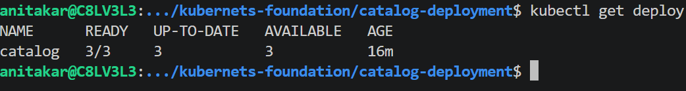

kubectl get pod -o wide 
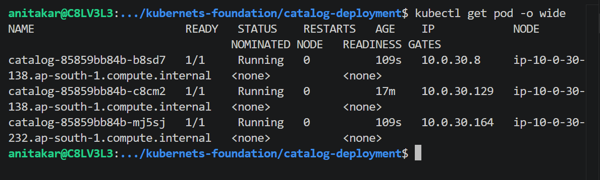

kubectl scale deployment catalog replicas=1
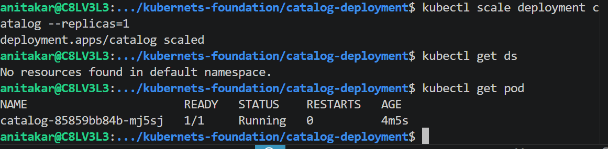

# Rolling Update (Upgrade App Version)

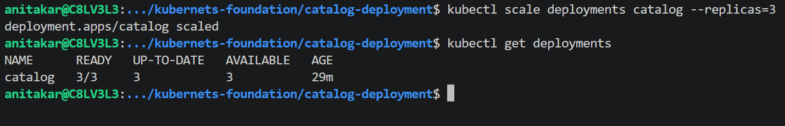
kubectl rollout history deployment/catalog
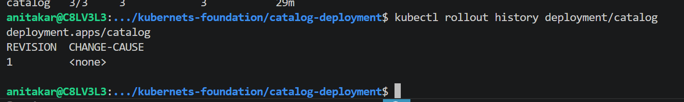

# Update the Deployment image
# List Deployment Revisions
kubectl rollout history deployment/catalog
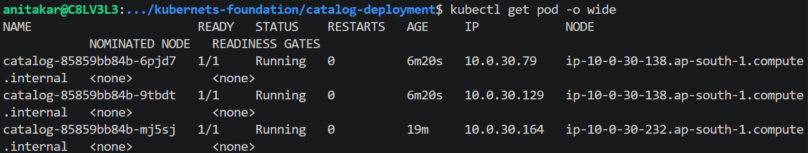

# Update the Deployment
kubectl set image deployment/catalog catalog=public.ecr.aws/aws-containers/retail-store-sample-catalog:1.3.0
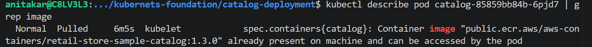

# List Deployment Revisions
kubectl rollout history deployment/catalog

# Rollback to Previous Version (1.0.0)
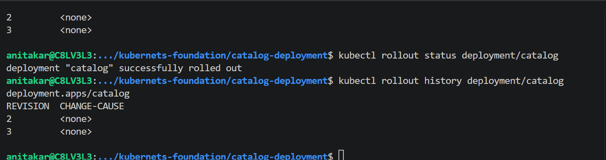
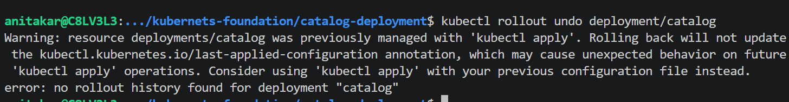
kubectl get 
Feature	Description
Deployment	Manages Pods & ensures desired state
ReplicaSet	Keeps specified number of Pods running
Rolling Update	Gradual version upgrade with zero downtime
Rollback	Instantly revert to previous working version
Scaling	Scale Pods up/down using a single command
Probes	Keep Pods healthy & automatically restarted if needed
Security Context	Enforces least privilege and non-root execution