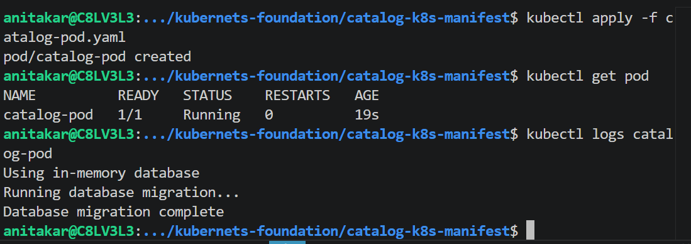
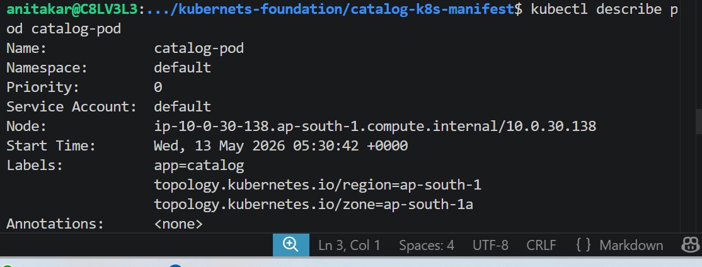
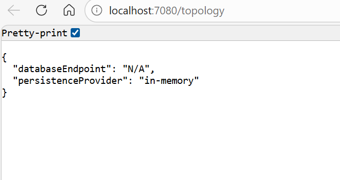
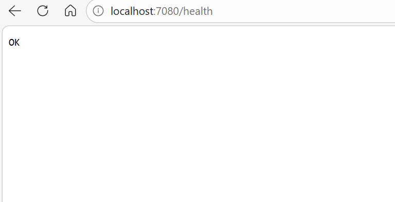
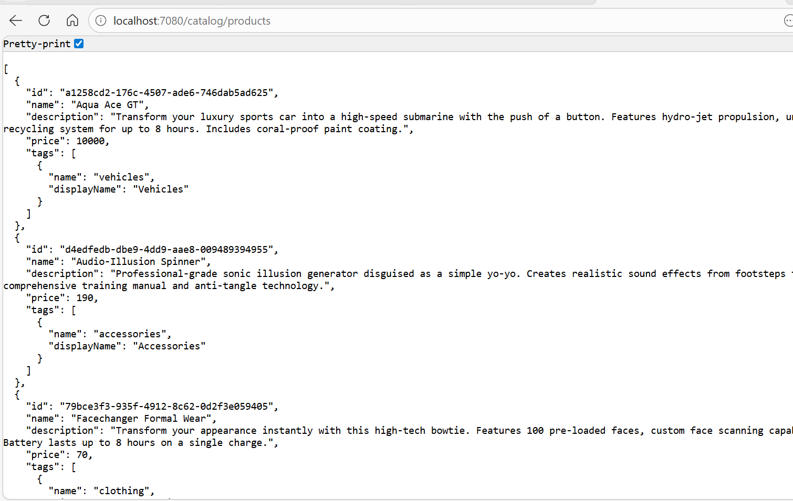
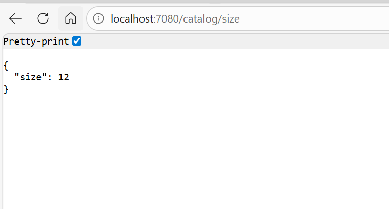
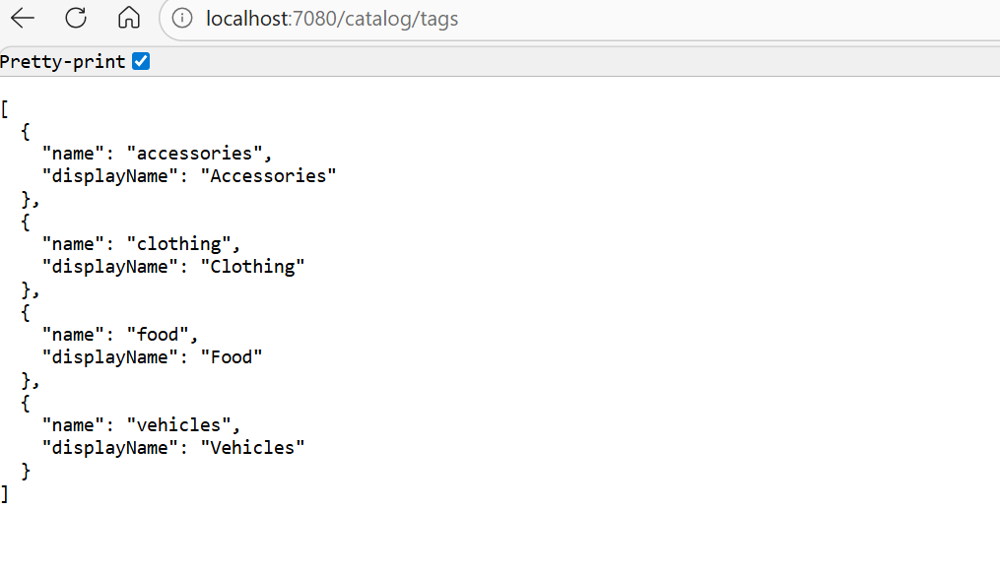
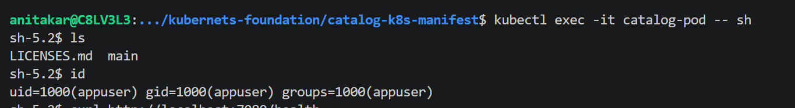
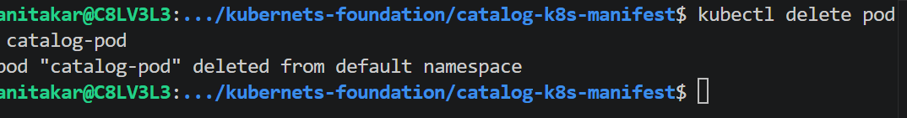

Deploy the catalog pod 

kubectl descripbe pod <pod-name>

# Access the Application via Port Forwarding
# Expose the Pod locally using:
kubectl port-forward pod/catalog-pod 7080:8080

# Topology Endpoint
http://localhost:7080/topology

# Health Endpoint
http://localhost:7080/health

# Catalog - Get Products
http://localhost:7080/catalog/products

# Catalog - Get Products By ID
http://localhost:7080/catalog/products/d77f9ae6-e9a8-4a3e-86bd-b72af75cbc49

# Catalog - Get Size
http://localhost:7080/catalog/size

# Catalog - Get Tags
http://localhost:7080/catalog/tags

# inside the pod 
kubectl exec -it catalog-pod -- sh

kubectl delete pod catalog-pod

