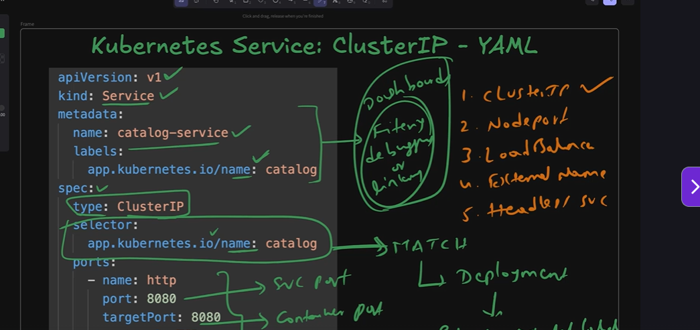
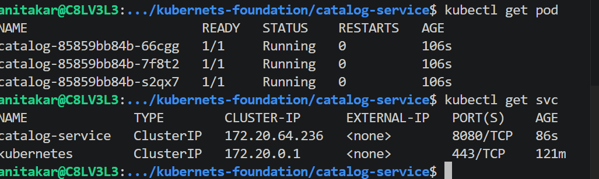
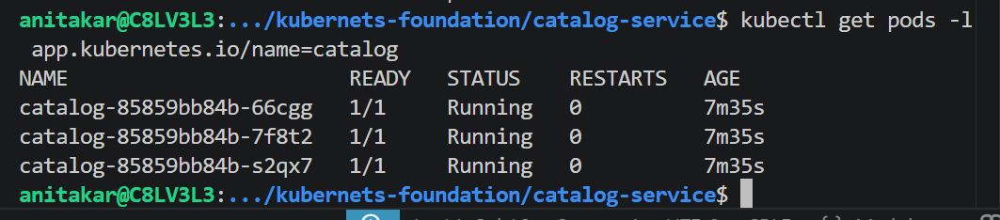
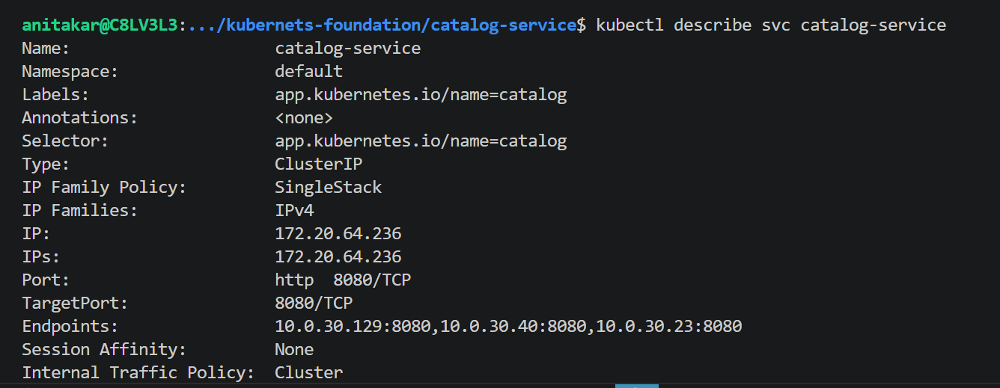
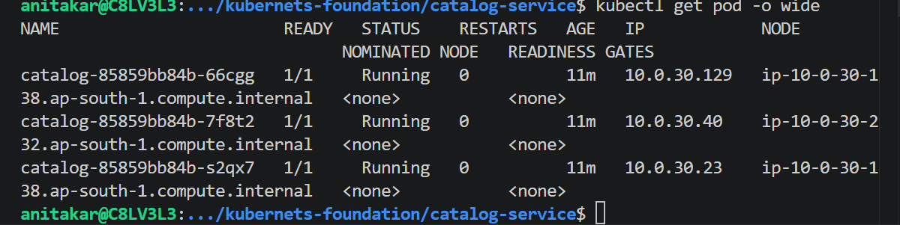
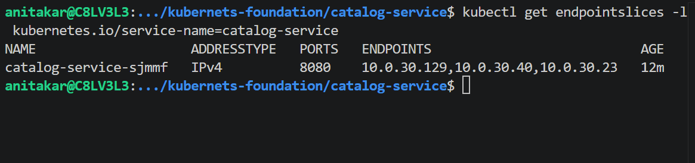
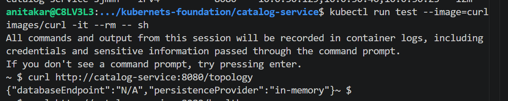
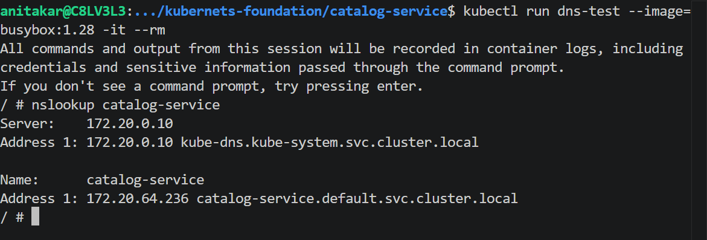

# metadata in yaml 
it will use for filtering,debug and linking 

# services in k8s
1. cluster ip
2. nodeport
3. loadbalancer 
4. extranal name
5. headless service

kubectl get pod
kubectl get svc

kubectl get pod -o wide

kubectl get endpointslices -l kubernetes.io/service-name=catalog-service

Key concept: Kubernetes uses the selector labels in the Service definition to automatically discover Pods that match those labels. It then creates an EndpointSlice object listing the Pod IPs and ports that belong to that Service.
Even if pods restart and get new IPs, the EndpointSlice automatically updates ensuring the Service always routes traffic to healthy, matching pods.

kubectl run test --image=curlimages/curl -it --rm -- sh

kubectl run dns-test --image=busybox:1.28 -it --rm
nslookup catalog-service
