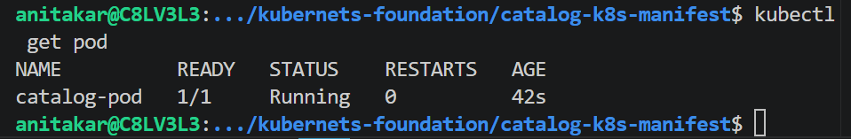
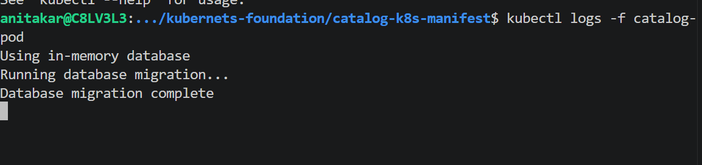
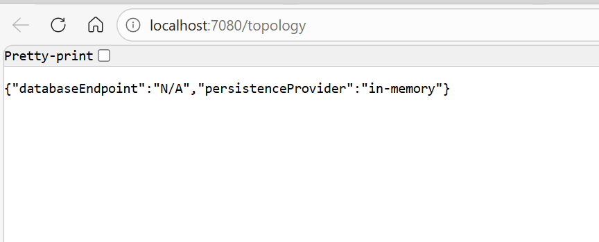
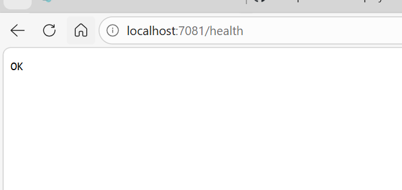
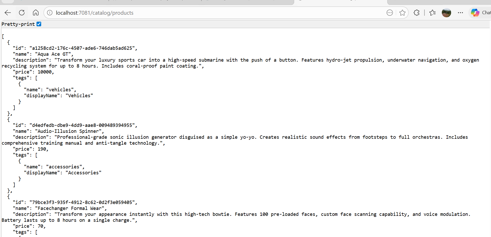
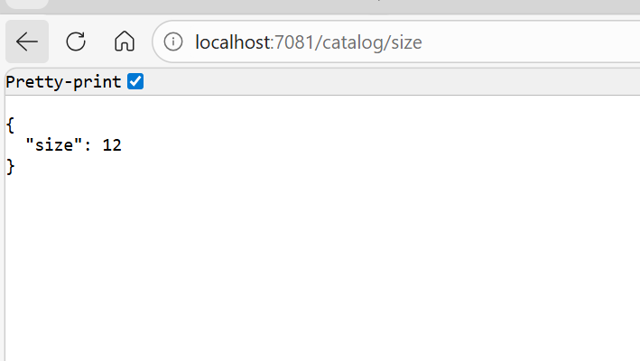

# what is pod?
pod is the smallest deployment unit in kubernetes.It is like wrapper on the container.apart from this it is store network,storage and identiry .

# what is sidecar container?
a sidecar container is the secondry container that run alongside the main  application container in the same kubernets pod

kubectl exec -it catlog-pod -- env 

kubectl aaply -f catalog-pod.yaml

# service account
A Service Account in Kubernetes provides an identity for Pods to communicate securely with the Kubernetes API server. It is commonly used with RBAC to control permissions for applications running inside the cluster.

# Qos classes
QoS Class in Kubernetes determines pod priority during resource pressure. Kubernetes assigns QoS automatically based on CPU and memory requests/limits. The three QoS classes are Guaranteed, Burstable, and BestEffort.

kubectl port-forword pod/catlog-pod 7080:8080

kubectl port-forword pod/catlog-pod 7081:8080

