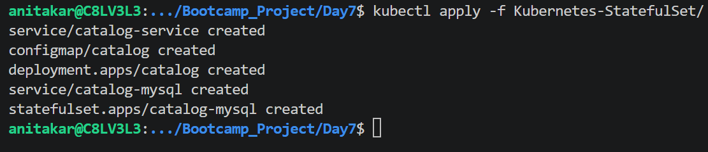
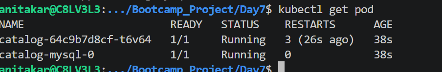
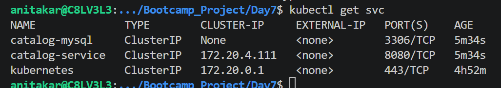
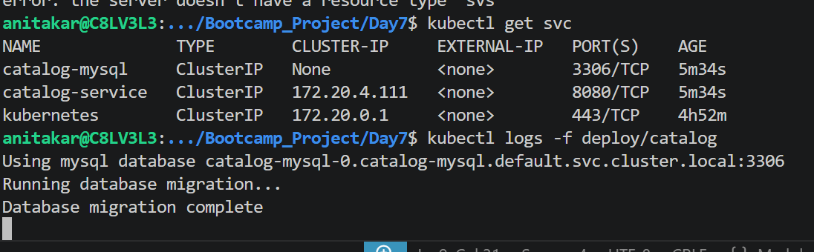
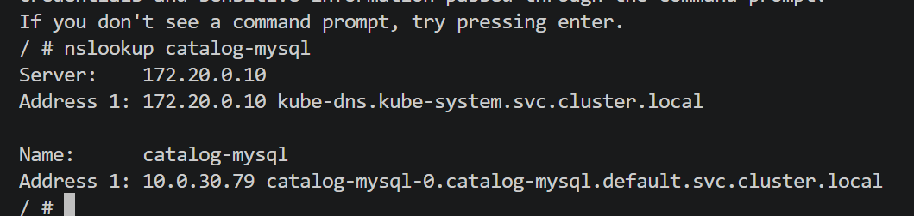
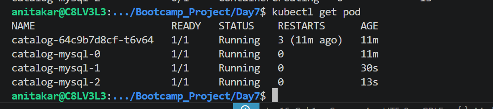
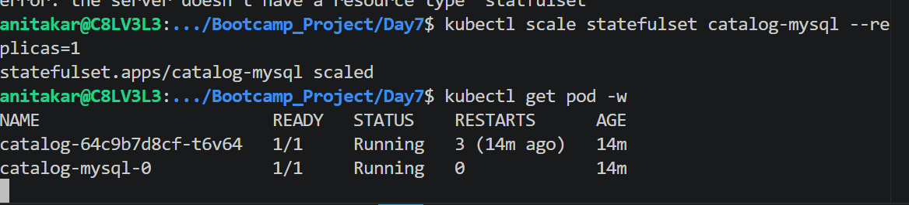
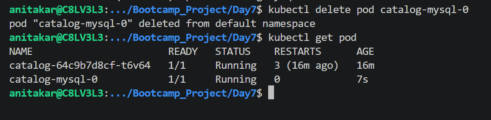
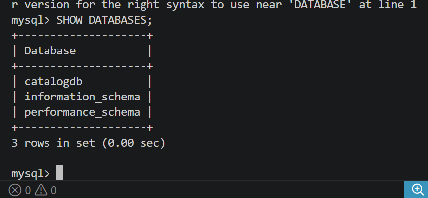

# View logs of the Catalog application (only one Pod under the Deployment)
kubectl logs -f deploy/catalog

# Test DNS Resolution

kubectl scale statefuleset catalog-mysql --replicas=3

scal down -revers order 
kubectl scale statefulset catalog-mysql --replicas=1
kubectl get pods -w

kubectl delete pod catalog-mysql-0

# Verify Database Connection Inside Cluster

kubectl run mysql-client --rm -it \
  --image=mysql:8.0 \
  --restart=Never \
  -- mysql -h catalog-mysql -u catalog_user -p

  What Annotations Store

# Annotations can store:

build information
commit IDs
contact details
monitoring configs
ingress settings
deployment history
tool-specific configuration
# identity 
Pod Identity	Identifies Pods/workloads
StatefulSet Identity	Stable identity for stateful Pods
Service Identity	Stable network identity
User Identity	Human user authentication
Service Account Identity	Identity for applications/Pods
Node Identity	Identity for worker nodes
Namespace Identity	Logical isolation identity
Cluster Identity	Unique cluster-level identity

In Kubernetes, Affinity and Anti-Affinity are scheduling rules that control where Pods should or should not run.

| Type              | Purpose                              |
| ----------------- | ------------------------------------ |
| Node Affinity     | Pod prefers specific nodes           |
| Pod Affinity      | Pod prefers running near another Pod |
| Pod Anti-Affinity | Pod avoids running near another Pod  |

