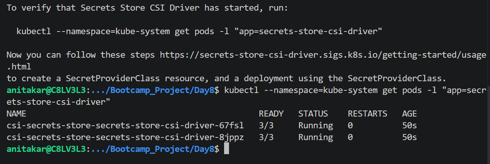
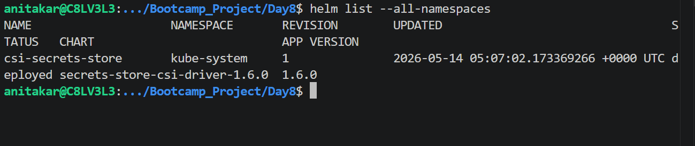
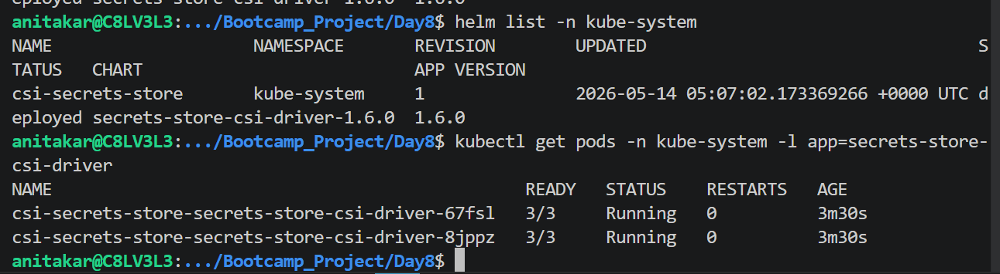
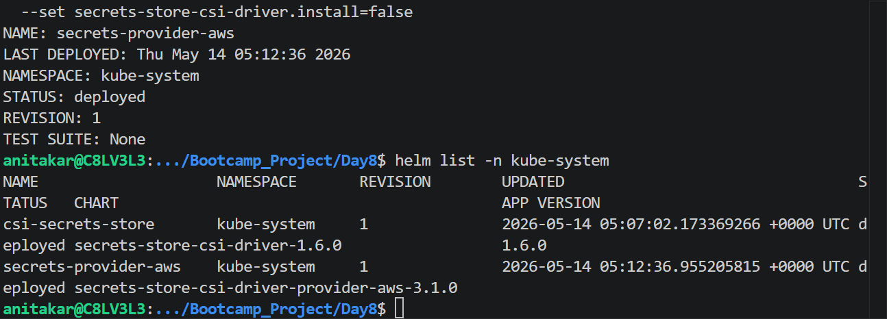
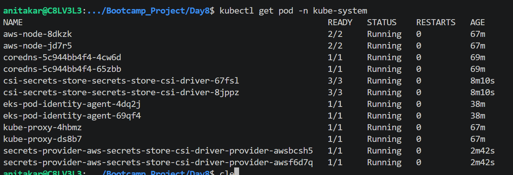
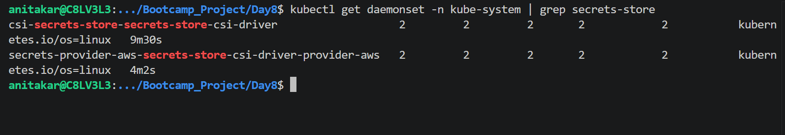
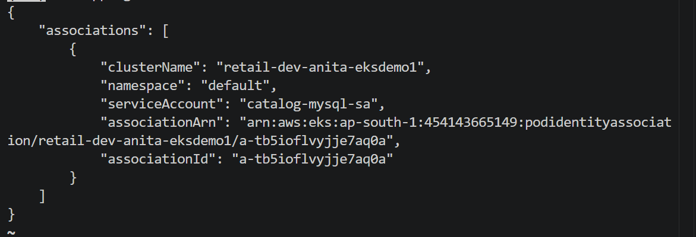

kubectl --namespace=kube-system get pods -l "app=secrets-store-csi-driver"

helm list --all-namespaces

# Install the Secrets Store CSI Driver in the kube-system namespace:
helm install csi-secrets-store \
  secrets-store-csi-driver/secrets-store-csi-driver \
  --namespace kube-system \
  --set tokenRequests[0].audience="pods.eks.amazonaws.com"

# List all Helm releases across namespaces:
helm list --all-namespaces

# List releases only in the kube-system namespace:
helm list -n kube-system

# Verify installation status, pods, and resources created by the release:
helm status csi-secrets-store -n kube-system

# Verify pods:
kubectl get pods -n kube-system -l app=secrets-store-csi-driver

# Install the AWS Provider
# Install the AWS Secrets Manager CSI Driver Provider in the kube-system namespace.
helm install secrets-provider-aws \
  aws-secrets-manager/secrets-store-csi-driver-provider-aws \
  --namespace kube-system \
  --set secrets-store-csi-driver.install=false

# List installed Helm Releases
helm list -n kube-system

# Inspect the AWS provider Helm release:
helm status secrets-provider-aws -n kube-system

# CSI driver pods
kubectl get pods -n kube-system -l app=secrets-store-csi-driver

# AWS provider (ASCP) pods
kubectl get pods -n kube-system -l app=secrets-store-csi-driver-provider-aws

kubectl get daemonset -n kube-system | grep secrets-store

# Change Directory
cd anita-iam-policy-json-files

# Create Catalog DB Secret Policy JSON file
cat <<EOF > catalog-db-secret-policy.json
{
  "Version": "2012-10-17",
  "Statement": [
    {
      "Effect": "Allow",
      "Action": [
        "secretsmanager:GetSecretValue",
        "secretsmanager:DescribeSecret"
      ],
      "Resource": "*"
    }
  ]
}
EOF

# Verify the values of AWS_REGION and AWS_ACCOUNT_ID
cat catalog-db-secret-policy.json

aws iam create-policy \
  --policy-name anita-catalog-db-secret-policy \
  --policy-document file://catalog-db-secret-policy.json
  
# Change Directory
cd iam-policy-json-files

# Create Trust Policy that allows EKS Pods to assume role through Pod Identity Agent
cat <<EOF > trust-policy.json
{
  "Version": "2012-10-17",
  "Statement": [
    {
      "Effect": "Allow",
      "Principal": {
        "Service": "pods.eks.amazonaws.com"
      },
      "Action": [
        "sts:AssumeRole",
        "sts:TagSession"
      ]
    }
  ]
}
EOF

  # Create IAM Role
aws iam create-role \
  --role-name anita-catalog-db-secrets-role \
  --assume-role-policy-document file://trust-policy.json

  # Attach the IAM policy to IAM Role
aws iam attach-role-policy \
  --role-name anita-catalog-db-secrets-role \
  --policy-arn arn:aws:iam::${AWS_ACCOUNT_ID}:policy/anita-catalog-db-secret-policy

  aws eks list-addons --cluster-name ${EKS_CLUSTER_NAME}

  # Verify Amazon EKS Pod Identity Agent Installation
aws eks list-addons --cluster-name ${EKS_CLUSTER_NAME}

## Sample Output
{
    "addons": [
        "eks-pod-identity-agent"
    ]
}

# Create Pod Identity Association
aws eks create-pod-identity-association \
  --cluster-name ${EKS_CLUSTER_NAME} \
  --namespace default \
  --service-account catalog-mysql-sa \
  --role-arn arn:aws:iam::454143665149:role/anita-catalog-db-secrets-role

  
  