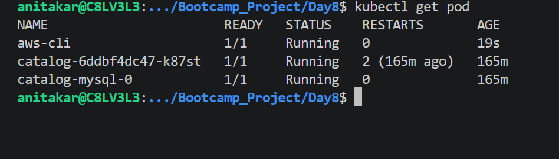
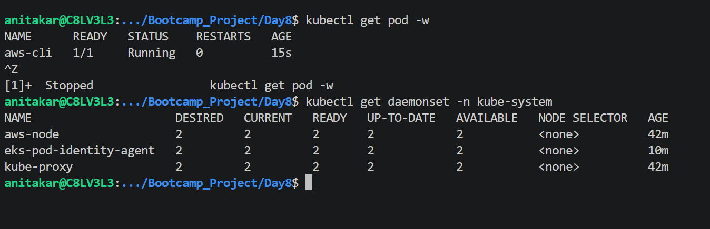
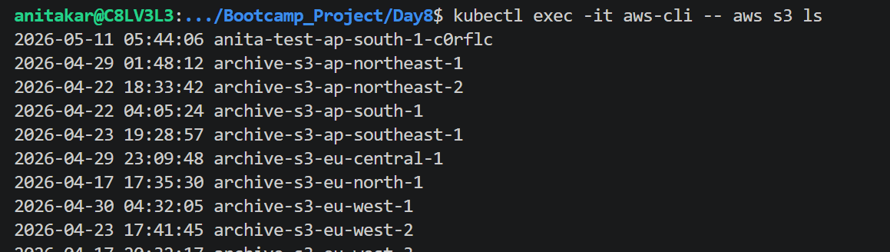

kubectl get daemonset -n kube-systen

kubectl exec -it aws-cli -- aws s3 ls

# EKS Auth API Validates Association

The API checks the Pod Identity Association (Namespace + ServiceAccount → IAM Role).
If valid, it returns temporary IAM credentials back to the Pod Identity Agent.

# 