pod identity
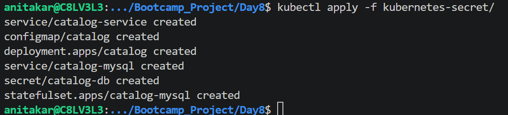

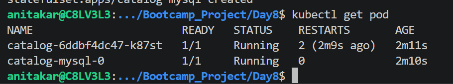

kubectl get svc
kubectl get secret
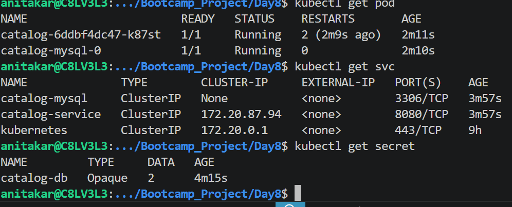

kubectl describe secret catalog-db
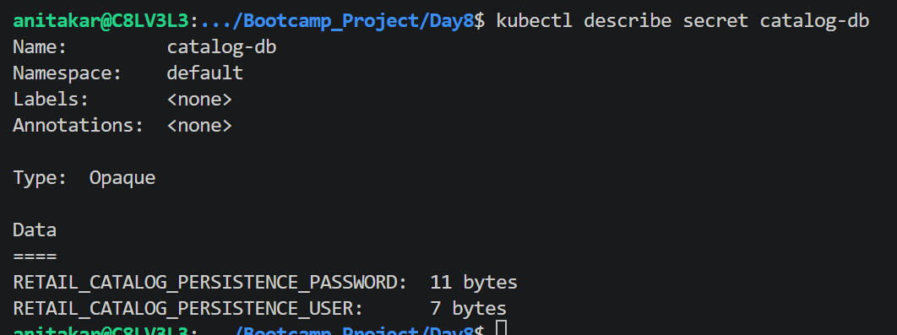

kubectl get secret catalog-db -o yaml
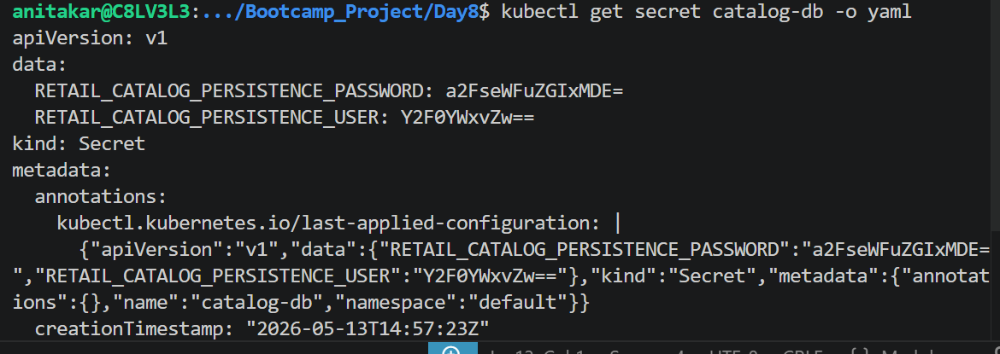

kubectl port-forword svc/catalog-service 7080:8080
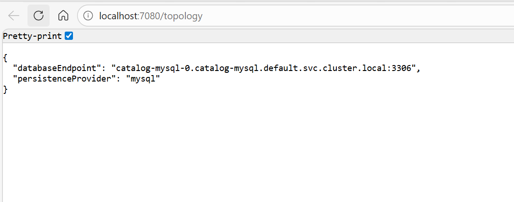

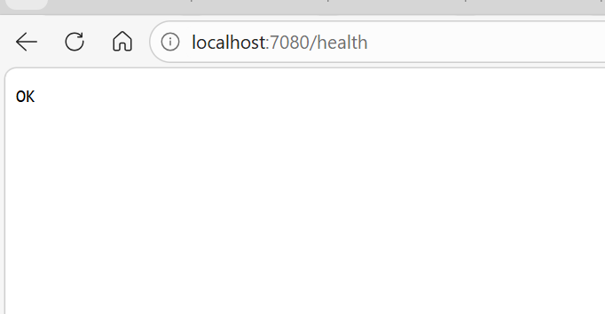

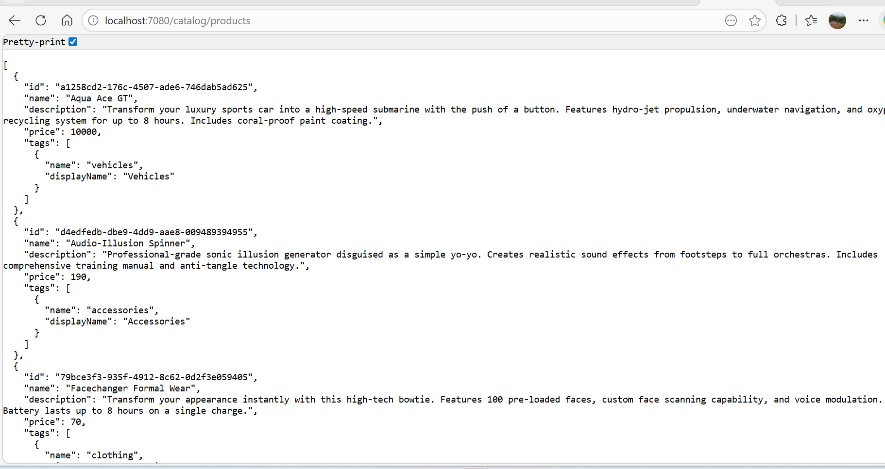

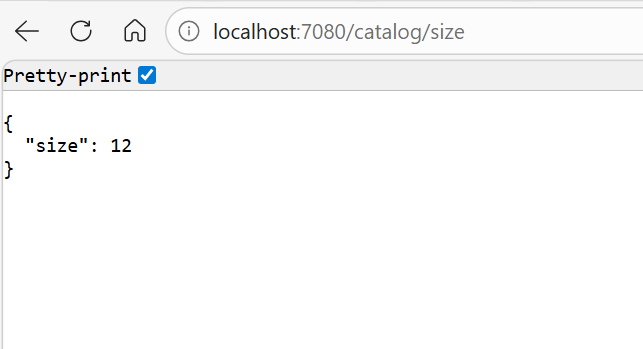

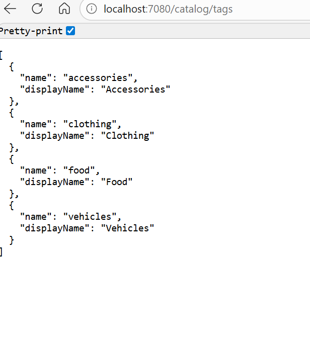

Concept	Description
ConfigMap	Stores non-sensitive data (configurations).
Secret	Stores sensitive data securely (credentials, tokens).
envFrom	Loads ConfigMap and Secret into Pod environment.
Security	Base64 encoding + restricted visibility in kubectl get output.

# kube-apiserver 
The core component server that expose the kubernets HTTP API 
# ETCD
consitent and highly available key value store for all api servre 
# kube-schuduler 
looks for pods not yet bound to a node, and assign each pod to a node 
# kube-controller-manager

# AWS secrete

aws secretsmanager create-secret \
  --name catalog-db-secret-10 \
  --region $AWS_REGION \
  --description "MySQL credentials for Catalog microservice" \
  --secret-string '{
      "MYSQL_USER": "mydbadmin",
      "MYSQL_PASSWORD": "kalyandb101"
  }'

  aws secretsmanager list-secrets --region $AWS_REGION --query "SecretList[?contains(Name, 'catalog-db-secret-10')].[Name,ARN]" --output table

  # Retrieve Secret Value (for testing only)
aws secretsmanager get-secret-value \
  --secret-id catalog-db-secret-10 \
  --region $AWS_REGION \
  --query SecretString --output text

# MySQL Pod
kubectl exec -it <mysql-pod-name> -- ls /mnt/secrets-store
kubectl exec -it <mysql-pod-name> -- cat /mnt/secrets-store/MYSQL_USER
kubectl exec -it <mysql-pod-name> -- cat /mnt/secrets-store/MYSQL_PASSWORD

# Catalog Pod
kubectl exec -it <catalog-pod-name> -- ls /mnt/secrets-store
kubectl exec -it <catalog-pod-name> -- cat /mnt/secrets-store/MYSQL_USER
kubectl exec -it <catalog-pod-name> -- cat /mnt/secrets-store/MYSQL_PASSWORD

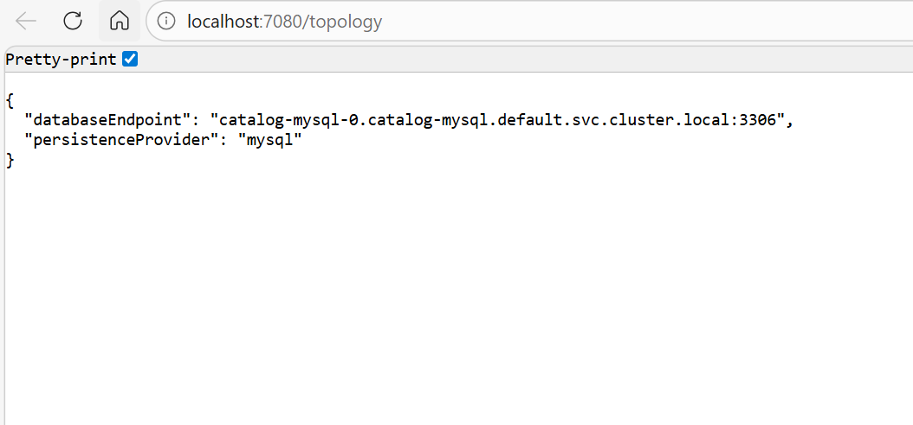

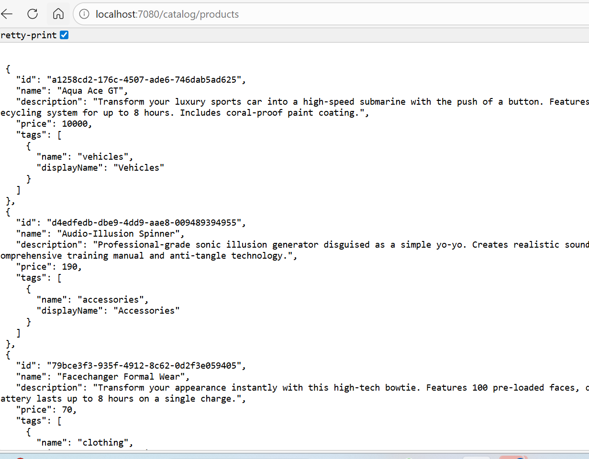
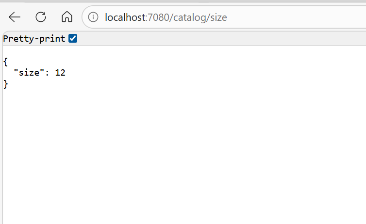
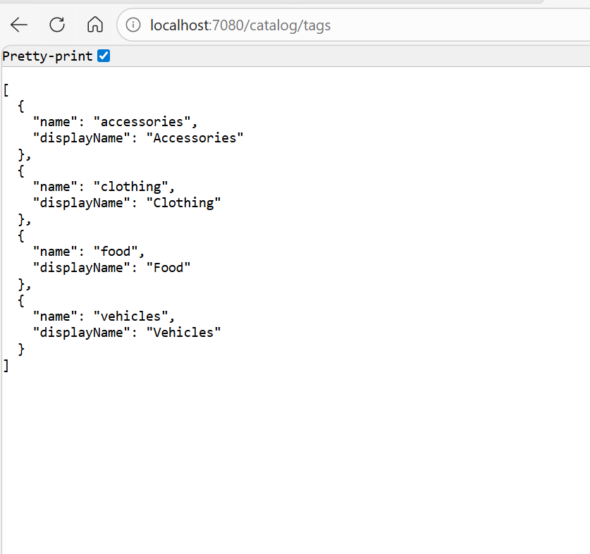
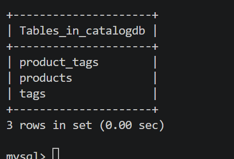

# Connect to MySQL Database using MySQL Client Pod
kubectl run mysql-client --rm -it \
  --image=mysql:8.0 \
  --restart=Never \
  -- mysql -h catalog-mysql -u mydbadmin -p

SHOW DATABASES;
USE catalogdb;
SHOW TABLES;
SELECT * FROM products;
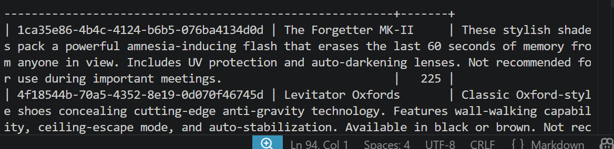
SELECT * FROM tags;
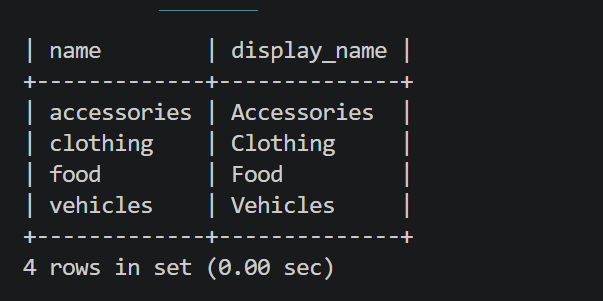
SELECT * FROM product_tags;
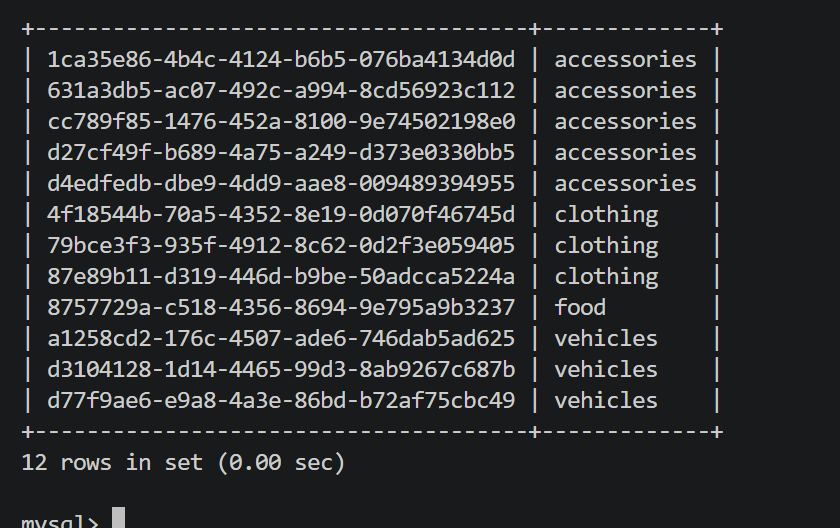
EXIT;